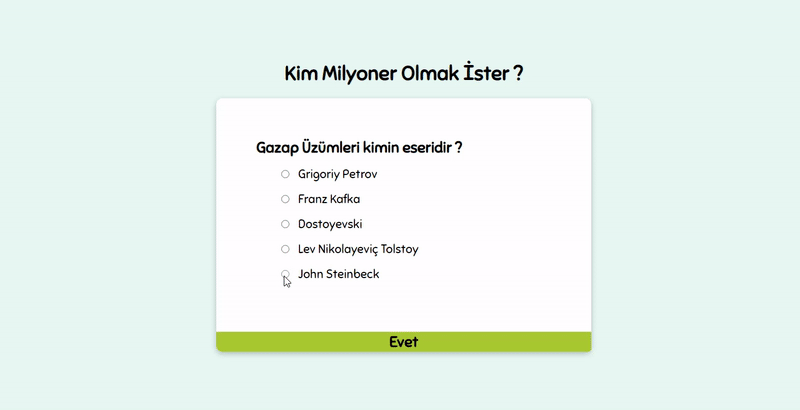

<h2>Quiz App</h2>

<h3> Used Techologies </h3>

HTML5 CSS JS 

<i>A small quiz app project with 5 questions. Each question is 20 points, for a total of 100 points.Questions can be answered again. </i>

